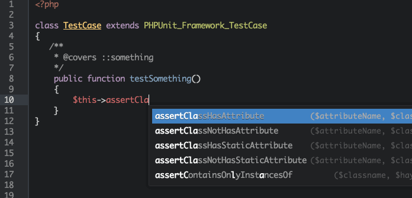

## Atom PHPUnit's assertions autocomplete
Yes. <br />
As you can see in this **awful** gif :-). You can see it?



## Generating
Install `composer`, you'll need it. And now install  dependencies using `composer install`, please.
```sh
$ composer install
```

And then, finally:

```sh
$ php -f scripts/generate-assertions.php >data/assertions.json
```

:beers:

Well, you'll don't need to do that, as the repository already includes the `assertions.json` file generated from `phpunit ~4.5`, so, bad idea, don't do.

## Contributing
You can, always.

## License
[MIT License](http://andreyknupp.mit-license.org/) © Andrey K.
